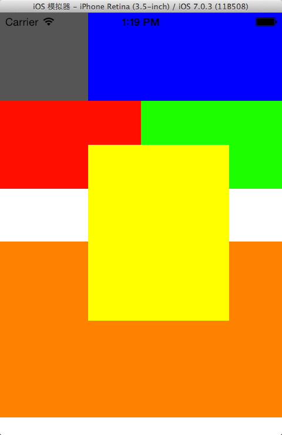

## 一. 三个结构体：CGPoint、CGSize、CGRect


### 1. CGPoint

表示一个二维坐标系中的点

```
/* Points. */

struct CGPoint {
  CGFloat x;
  CGFloat y;
};
typedef struct CGPoint CGPoint;
```

### 2.  CGSize
表示一个矩形的宽度和高度

```
/* Sizes. */

struct CGSize {
  CGFloat width;
  CGFloat height;
};
typedef struct CGSize CGSize;
```
### 3. CGRect
表示一个矩形的位置和大小

```
/* Rectangles. */

struct CGRect {
  CGPoint origin;//偏移是相对父窗口的
  CGSize size;
};
typedef struct CGRect CGRect;
```
**这三个结构体均在一个头文件里: CGGeometry.h**

## 二. 三个方法: CGPoint、CGSize 、CGRectMake

### 1.CGPoint
```
CG_INLINE CGPoint
CGPointMake(CGFloat x, CGFloat y)
{
  CGPoint p; p.x = x; p.y = y; return p;
}
```
绘制起点

### 2. CGSize

```
CG_INLINE CGSize
CGSizeMake(CGFloat width, CGFloat height)
{
  CGSize size; size.width = width; size.height = height; return size;
}
```
绘制宽高

### 3.CGRectMake

```
CG_INLINE CGRect
CGRectMake(CGFloat x, CGFloat y, CGFloat width, CGFloat height)
{
  CGRect rect;
  rect.origin.x = x; rect.origin.y = y;
  rect.size.width = width; rect.size.height = height;
  return rect;
}
```

绘制一个矩形，确定origin（起点，左上角），宽与高，就可以画出一个对应的位置与大小的rect（矩形）这个函数被声明为内联函数，一是因为它比较小，二是因为在画界面时我们要求一定的效率。

**这个函数在：CGGeometry.h**

## 三. 几个基本界面元素：window（窗口）、视图（view）

要在屏幕上显示内容首先要创建一个窗口承载内容，要创建一个窗口，需要一个边框（frame），含有边框信息的底层 结构就是CGRect。

每个能够在屏幕上显示自己的对象都有一个边框，定义了他的显示区域，不过许多高层的视图类会自动计算这一信息。其他的那些类则在视图初始化时通过一个initWithFrame的初始化方法来设置。

### UIScreen

UIScreen类代表了屏幕，通过这个类我们可以获取一些想要的东东。

```
CGrect screenBounds = [ [UIScreen mainScreen]bounds];//返回的是带有状态栏的Rect
CGRect viewBounds = [ [UIScreen mainScreen]applicationFrame];//不包含状态栏的Rect

//screenBounds 与 viewBounds 均是相对于设备屏幕来说的

//所以 screenBounds.origin.x== 0.0 ;   screenBounds.oringin.y = 0.0;   
screenBounds.size.width == 320;  screenBounds.size.height == 480(或者其他分辨率有所差异)

//所以 screenBounds.origin.x== 0.0 ;   screenBounds.oringin.y = 20.0;(因为状态栏的高度是20像素) 
  screenBounds.size.width == 320;  screenBounds.size.height == 480
```

### UIView

UIView类继承自UIResponder,它负责显示画布，如果把window比作画框。我们就是不断地在画框上移除、更换或者叠加画布，或者在画布上叠加其他画布，大小由绘画者来决定。有了画布，我们就可以在上面任意而为了。

**这个类在: UIView.h**

```
//这里创建了一块画布，定义了相对于父窗口的位置， 以及大小。
UIView* myView =[[ UIView alloc]initWithFrame:CGRectMake(0.0,0.0,200.0,400.0)];
```

### UIWindow

UIWindow继承自UIView，关于这一点可能有点逻辑障碍，画框怎么继承自画布呢？

不要过于去钻牛角尖，画框的形状不就是跟画布一样吗？拿一块画布然后用一些方法把它加强，是不是可以当一个画框用呢？这也是为什么一个view可以直接加到另一个view上去的原因了。

看一下系统的初始化过程（在application didFinishLauchingWithOptions里面）：

```
self.window = [[UIWindow alloc] initWithFrame:[[UIScreen mainScreen] bounds]];
self.window.backgroundColor = [UIColor grayColor];//给window设置一个背景色
[self.window makeKeyAndVisible];//让window显示出来
```
## 四. 实例演示

1）新建一个Empty Application项目,名字随意

2) 在application didFinishLaunchingWithOptions里面，你会发现系统已经建好一个画框了，我们现在就用系统帮我们建好的画框，你当然也可以自己建一个画框，不过没这个必要，一个应用程序只能有一个画框。

打开SimpleTableAppDelegate.m,文件,修改didFinishLaunchingWithOptions

```

- (BOOL)application:(UIApplication *)application didFinishLaunchingWithOptions:(NSDictionary *)launchOptions
{
    self.window = [[UIWindow alloc] initWithFrame:[[UIScreen mainScreen] bounds]];//系统帮你建画框
    // Override point for customization after application launch.
    NSLog(@"----- 返回的是带有状态栏的Rect ----- ");
    CGRect bound = [[UIScreen mainScreen]bounds];
    NSLog(@"boundwidth:%f    boundheight:%f ",bound.size.width, bound.size.height);
    NSLog(@"boundx:%f    boundy:%f ",bound.origin.x, bound.origin.y);
    NSLog(@"----- 返回不包含状态栏的Rect ----- ");
    CGRect appBound = [[UIScreen mainScreen]applicationFrame];
    NSLog(@"appBoundwidth:%f appBoundheight:%f "
          ,appBound.size.width,appBound.size.height);
    NSLog(@"appBoundx:%f    appBoundy:%f ",appBound.origin.x, appBound.origin.y);

    
    //----------------------- 第一个灰色矩形 -----------------------
    
    //1. 设置起点
    CGPoint dark_point = CGPointMake(0.0f, 0.0f);
    //2. 设置长度和宽度100*100
    CGSize dark_size = CGSizeMake(100.0f, 100.0f);
    //3. 绘制矩形
    CGRect dark_rect = CGRectMake(dark_point.x, dark_point.y, dark_size.width, dark_size.height);
    //4. 初始化view
    UIView *dark = [[UIView alloc]initWithFrame:dark_rect];
    //5. 为矩形视图设置背景色
    dark.backgroundColor = [UIColor darkGrayColor];
    //6. 增加一个视图到接收者的子视图列表中
    [self.window addSubview:dark];
    
    NSLog(@"----- 打印几何元素的值 -----");
    
    NSLog(@"dark_point: %@", NSStringFromCGPoint(dark_point));
    
    NSLog(@"dark_size: %@", NSStringFromCGSize(dark_size));
    
    NSLog(@"dark_rect: %@", NSStringFromCGRect(dark_rect));
    
    //----------------------- 第二个蓝色矩形 -----------------------
    //画第一块画布然涂成蓝色，大小是320 X 100
    CGRect blue_rect = CGRectMake(100.0, 0.0, 320, 100);
    UIView *blue = [[UIView alloc]initWithFrame:blue_rect];
    blue.backgroundColor = [UIColor blueColor];
    [self.window addSubview:blue];

    //----------------------- 第三个红色矩形 -----------------------
    CGRect red_rect = CGRectMake(0.0, 100, 160, 100);
    UIView *red = [[UIView alloc]initWithFrame:red_rect];
    red.backgroundColor = [UIColor redColor];
    [self.window addSubview:red];

    //----------------------- 第四个红色矩形 -----------------------
    CGRect CGthree = CGRectMake(160, 100, 160, 100);
    UIView *v_three = [[UIView alloc]initWithFrame:CGthree];
    v_three.backgroundColor = [UIColor greenColor];
    [self.window addSubview:v_three];
    
    //----------------------- 第五个橙色矩形 -----------------------
    CGRect orange_rect = CGRectMake(0.0, 260, 320, 200);
    UIView *range = [[UIView alloc]initWithFrame:orange_rect];
    range.backgroundColor = [UIColor orangeColor];
    [self.window addSubview:range];
    
    //----------------------- 第六个黄色矩形 -----------------------
    CGRect yellow_rect = CGRectMake(100, 150,160, 200);
    UIView *yello = [[UIView alloc]initWithFrame:yellow_rect];
    yello.backgroundColor = [UIColor yellowColor];//黄色
    [self.window addSubview:yello];
    
    //设备背景色为白色
    self.window.backgroundColor = [UIColor whiteColor];
    //使被使用对象的主窗口显示到屏幕的最前端
    [self.window makeKeyAndVisible];
    return YES;
}

```
日志:

```
2014-03-07 13:11:39.573 TestButton[10450:70b] ----- 返回的是带有状态栏的Rect ----- 
2014-03-07 13:11:39.574 TestButton[10450:70b] boundwidth:320.000000    boundheight:480.000000 
2014-03-07 13:11:39.574 TestButton[10450:70b] boundx:0.000000    boundy:0.000000 
2014-03-07 13:11:39.574 TestButton[10450:70b] ----- 返回不包含状态栏的Rect ----- 
2014-03-07 13:11:39.575 TestButton[10450:70b] appBoundwidth:320.000000 appBoundheight:460.000000 
2014-03-07 13:11:39.575 TestButton[10450:70b] appBoundx:0.000000    appBoundy:20.000000 
2014-03-07 13:11:39.575 TestButton[10450:70b] ----- 打印几何元素的值 -----
2014-03-07 13:11:39.576 TestButton[10450:70b] dark_point: {0, 0}
2014-03-07 13:11:39.576 TestButton[10450:70b] dark_size: {100, 100}
2014-03-07 13:11:39.576 TestButton[10450:70b] dark_rect: {{0, 0}, {100, 100}}
```
显示:



```
参考资料：
- http://blog.csdn.net/iukey/article/details/7083165
- 本文在在Mac OS 10.91 /xcode5/iOS7测试通过
```

----
####  微信公众帐号: wirelessqa 


#### 关于作者：

**作者:** 毕小朋 | 老 毕  **邮箱:** <wirelessqa.me@gmail.com> 

**微博:** [@WirelessQA](http://www.weibo.com/wirelessqa) **博客:** <http://blog.csdn.net/wirelessqa>

----