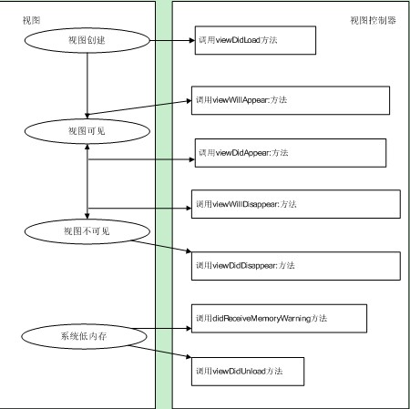

## iOS视图控制对象生命周期

视图控制器方法|说明
--|--
init|初始化程序
viewDidLoad|加载视图
viewWillAppear|UIViewController对象的视图即将加入窗口时调用
viewDidApper|UIViewController对象的视图已经加入到窗口时调用
viewWillDisappear|UIViewController对象的视图即将消失、被覆盖或是隐藏时调用
viewDidDisappear|UIViewController对象的视图已经消失、被覆盖或是隐藏时调用
viewWillUnload|当内存过低时，需要释放一些不需要使用的视图时，即将释放时调用
viewDidUnload|当内存过低，释放一些不需要的视图时调用。

## iOS视图控制器方法调用顺序


视图控制对象通过alloc和init来创建，但是视图控制对象不会在创建的那一刻就马上创建相应的视图，而是等到需要使用的时候才通过调用loadView来创建，这样的做法能提高内存的使用率。

比如，当某个标签有很多UIViewController对象，那么对于任何一个UIViewController对象的视图，只有相应的标签被选中时才会被创建出来。

viewDidLoad方法：视图控制器已被实例化，在视图被加载到内存中的时候调用该方法，这个时候视图并未出现。在该方法中通常进行的是对所控制的视图进行初始化处理。

视图可见前后会调用viewWillAppear:方法和viewDidAppear:方法；

视图不可见前后会调用viewWillDisappear:方法和viewDidDisappear:方法。 

4个方法调用父类相应的方法以实现其功能， 编码时该方法的位置可根据实际情况做以调整，

```
-(void)viewWillAppear:(BOOL)animated

{

[super viewWillAppear:YES];

… …

}
```

viewDidLoad方法在应用运行的时候只调用一次，而这上述4个方法可以被反复调用多次，它们的使用很广泛但同时也具有很强的技巧性。


例如：有的应用会使用重力加速计，重力加速计会不断轮询设备以实时获得设备在z轴、x轴和y轴方向的重力加速度。不断的轮询必然会耗费大量电能进而影响电池使用寿命，我们通过利用这4个方法适时地打开或者关闭重力加速计来达到节约电能的目的。怎么使用这4个方法才能做到“适时”是一个值得思考的问题。

iOS系统在低内存时情况下会调用didReceiveMemoryWarning:和viewDidUnload:方法。

iOS6之后就不再使用viewDidUnload:，而仅支持didReceiveMemoryWarning：。didReceiveMemoryWarning：方法的主要职能是释放内存，包括视图控制器中的一些成员变量和视图的释放。

```
- (void)didReceiveMemoryWarning {

self.button = nil;
self.myStringD = nil;
[myStringC release];

[super didReceiveMemoryWarning];
}
```

```
本文参考:
http://blog.csdn.net/weasleyqi/article/details/8090373
http://www.ituring.com.cn/article/28553
```

----
####  微信公众帐号: wirelessqa 


#### 关于作者：

**作者:** 毕小朋 | 老 毕  **邮箱:** <wirelessqa.me@gmail.com> 

**微博:** [@WirelessQA](http://www.weibo.com/wirelessqa) **博客:** <http://blog.csdn.net/wirelessqa>

----