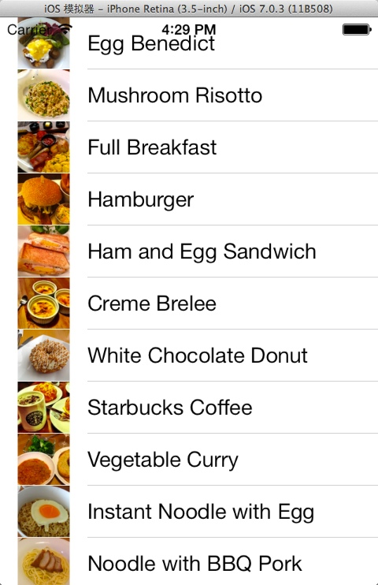
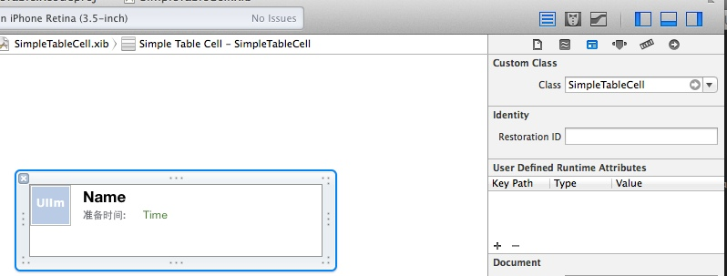
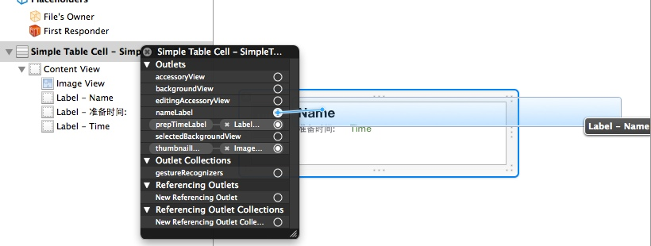
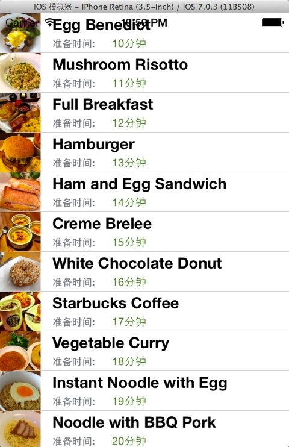
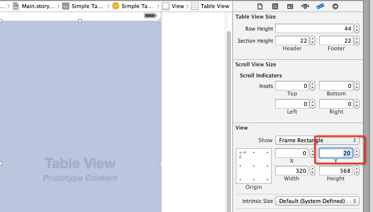
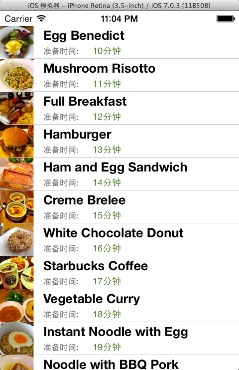

# 一起学习iOS开发二定制UITableView表视图单元格

## 一. 实现视图中不同的行显示不同的缩略图

步骤：

1. 导入用到的缩略图文件 
2. 定义一个数组,用于存放缩略图文件名 
3. 实例化数组,将文件名存到到数组,要与tableview列表名一一对应
4. 修改cellForRowAtIndexPath方法


### 1.1 导入用到的缩略图文件 
右击simple table文件夹,add files to "simple table.." -- 选中文件 -- add

### 1.2 定义一个数组,用于存放缩略图文件名 

添加一个新的数组thumbnails：

```
{

    //定义一个实例变量用来存放数组
    NSArray *tableData;
    //定义一个数组来存放缩略图名称列表
    NSArray *thumbnails;
}

```

### 1.3 实例化数组,将文件名存到到数组,要与tableview列表名一一对应

```
- (void)viewDidLoad
{
    //在控制器的视图装载到内存中完成之后,调用该方法
    [super viewDidLoad];
	
    //用arrayWithObjects来实例化一个NSArray对象
    tableData = [NSArray arrayWithObjects:@"Egg Benedict",
                 @"Mushroom Risotto", @"Full Breakfast", @"Hamburger", @"Ham and Egg Sandwich", @"Creme Brelee", @"White Chocolate Donut", @"Starbucks Coffee", @"Vegetable Curry", @"Instant Noodle with Egg", @"Noodle with BBQ Pork", @"Japanese Noodle with Pork", @"GreenTea", @"Thai Shrimp Cake", @"Angry Birds Cake", @"Ham and Cheese Panini", nil];
    //实例化数组thumbnails
    //图片名称的顸序和tableData数组的顺序保持一致,这样才能一一对应
    thumbnails = [NSArray arrayWithObjects:@"egg_benedict.jpg", @"mushroom_risotto.jpg", @"full_breakfast.jpg", @"hamburger.jpg", @"ham_and_egg_sandwich.jpg", @"creme_brelee.jpg", @"white_chocolate_donut.jpg", @"starbucks_coffee.jpg", @"vegetable_curry.jpg", @"instant_noodle_with_egg.jpg", @"noodle_with_bbq_pork.jpg", @"japanese_noodle_with_pork.jpg", @"green_tea.jpg", @"thai_shrimp_cake.jpg", @"angry_birds_cake.jpg", @"ham_and_cheese_panini.jpg", nil];
}

```

### 1.4 修改cellForRowAtIndexPath方法

```
cell.imageView.image = [UIImage imageNamed:[thumbnails objectAtIndex:indexPath.row]];
```
说明:

在每一行数据显示之前,iOS自动调用一次cellForRowAtIndexPath方法:

```
-(UITableViewCell *)tableView:(UITableView *)tableView cellForRowAtIndexPath:(NSIndexPath *)indexPath
```
参数indexPath为数据行的行编号,可通过indexPath.row获取当前指向的行,数据从0开始，也就是当前指定第一行的indexPath.row的值为0


### 1.5 查看运行结果



##二. 定制表视图单元格

之前使用的都是表视图的默认样式,缩图图的大小和位置都是固定的,那么如何定制呢？

### 2.1 设计单元格

#### 2.1.1. 新建一个空的xib

command + N -- User Interface -- empty -- Next -- iPhone -- Next -- Save as "SimpleTableCell.xib" -- Create 

#### 2.1.2. 拖动控件到设计区

点SimpleTableCell.xib 文件切换到 Interface Builder 窗口,在对象库(Object Library)中,选择 Table View Cell 控件,拖拉到Interface Builder 窗口的设计区域


### 2.2 为定制单元格创建类

如何改变定制单元格的标签值呢?
为定制的表视图单元格创建一个新类。这个类表示定制单元格的底层数据

#### 2.2.1 创建一个新类SimpleTableCell

新建一个类SimpleTableCell,在Choose options for your new file 选择UITableViewCell作为Subclass of 下拉选项,Next并Create,会创建两个文件：SimpleTableCell.h和SimpleTableCell.m

#### 2.2.2 SimpleTableCell.h文件中添加属性

我们希望在单元格中,有3个值是需要变更的:缩略图、菜谱名称标签和时间标签
因此在SimpleTableCell.h中我们添加这3个属性,分别表示这些动态


```
//
//  SimpleTableCell.h
//  SimpleTable
//
//  Created by bixiaopeng on 14-2-23.
//  Copyright (c) 2014年 bixiaopeng. All rights reserved.
//

#import <UIKit/UIKit.h>

@interface SimpleTableCell : UITableViewCell

/*
说明:
1. weak和nonatomic是property 的特性。
2. UILabel和UIImageView是类型
3. nameLabel、prepTimeLabel是thumbnailImageView 是变量名称。
4. IBOutlet可理解为一个指示符(indicator)。为了关联实例变量和表视图单元格(如 SimpleTableCell.xib)中的元素,我们使用IBOutlet关键字,让Interface Builder知道它们允许建立连接。
 */

//菜谱名
@property(nonatomic,weak) IBOutlet UILabel *nameLabel;

//时间
@property(nonatomic,weak) IBOutlet UILabel *prepTimeLabel;

//缩略图
@property(nonatomic,weak) IBOutlet UIImageView *thumbnailImageView;

@end


```

#### 2.2.3 SimpleTableCell.m中添加@synthesize指令

```
@implementation SimpleTableCell

//@synthesize 关键字告诉编译器自动生成代码,用来讵问前面定义的属性

@synthesize nameLabel = _nameLabel;

@synthesize prepTimeLabel = _prepTimeLabel;

@synthesize thumbnailImageView = _thumbnailImageView;
```


### 3. 建立连接

下面我们将在类的属性和界面上的控件(ImageView、Label)上建立连接

关联单元格视图(cell view)和前面创建的定制类

1. 选择单元格,并在 Identity Inspector 窗口中,选择类 SimpleTableCell


2. 右击SimpleTableCell,将nameLable与视图中的Name关联


3. PreTimeLabel和thumbnailImageView与视图关联的方法同上


### 4. 更新 SimpleTableViewController.m

我们已经完成了定制表规图单元格的设计和代码编写工作,最后一步，在 SimpleTableViewController 中使用定制单元格

#### 4.1. \#import "SimpleTableCell.h"
#### 4.2. 定义preTime数组,用于存放时间列表

```
//定义准备时间数组
NSArray *preTime;
```    
#### 4.3. 在viewDidLoad方法中实例化preTime数组

```  
preTime = [NSArray arrayWithObjects:@"10分钟", @"11分钟", @"12分钟", @"13分钟", @"14分钟", @"15分钟", @"16分钟", @"17分钟", @"18分钟", @"19分钟", @"20分钟", @"21分钟", @"22分钟", @"23分钟", @"24分钟", @"25分钟", nil];
     
```

#### 4.4. 修改cellForRowAtIndexPath方法

```
-(UITableViewCell *)tableView:(UITableView *)tableView cellForRowAtIndexPath:(NSIndexPath *)indexPath
{
    static NSString *simpleTableIdentifier = @"SimpleTableItem";

    //使用 UITableView 类的dequeueReusableCellWithIdentifer: 方法获取 SimpleTableCell 类的一个实例。
    SimpleTableCell *cell = (SimpleTableCell *)[tableView dequeueReusableCellWithIdentifier:simpleTableIdentifier];
    if (cell == nil) {
        //设置加载的nib
        NSArray *nib = [[NSBundle mainBundle] loadNibNamed:@"SimpleTableCell" owner:self options:nil];
        cell = [nib objectAtIndex:0];
    }
    cell.nameLabel.text = [tableData objectAtIndex:indexPath.row];
    cell.thumbnailImageView.image = [UIImage imageNamed:[thumbnails objectAtIndex:indexPath.row]];
    cell.prepTimeLabel.text = [preTime objectAtIndex:indexPath.row];
    return cell;
}
```
#### 4.5. 添加方法heightForRowAtIndexPath

因为表单元格的高度更改为 78,因此在 @end 代码行之前添加如下代

```
- (CGFloat)tableView:(UITableView *)tableView heightForRowAtIndexPath:(NSIndexPath *)indexPath
{
    return 78;
}
```
### 5. 运行结果



### 6. 如何解决表格与状态栏重叠的问题？

因为ios7中默认是全屏显示，UITableView编译后，表格会与状态条重叠显示,如何解决呢？鉴于我目前的知识水平，如下方法是最简单的。

**解决办法:在Table View的Size inspector面板中将其Y坐标向下偏移20**


查看运行结果



----
####  微信公众帐号: wirelessqa 


#### 关于作者：

**作者:** 毕小朋 | 老 毕  **邮箱:** <wirelessqa.me@gmail.com> 

**微博:** [@WirelessQA](http://www.weibo.com/wirelessqa) **博客:** <http://blog.csdn.net/wirelessqa>

----
